.. index:: development

.. _develop:

Developing guide
----------------

This guide will provide instructions to install the development environment needed to compile and debug the demo firmware of the PMOD-Sigfox. The development system is built for Windows.
The main steps are:

- Install Codewarrior Special Edition Software

- Import build & debug the source project

Hardware required:

- PMOD-Sigfox

- RSR1066 board

- FRDM-KL26Z board by Freescale

- Mini-USB cable

- PC with Windows

Install Codewarriror
********************

Special Editions are fully functional free download versions of the CodeWarrior Development Studio with code size restrictions on the build chain. Special Editions are pre-licensed, not bound to a single machine and are not time restricted. You do not need to register the tools or ask for a license.

Download the IDE from `this page <http://www.freescale.com/tools/software-and-tools/software-development-tools/codewarrior-development-tools/downloads/special-edition-software:CW_SPECIALEDITIONS>`_, we used Codewarriror for Microcontrollers **v10.6.4**.

Next, launch the downloaded file **CW_MCU_v10.6.4_Special_Edition.exe** following all the default options. Once it is installed will be created its icon on the desktop.

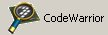

Prepare the Hardware
********************

Here you will see all the messages sent by your device. Now take the FRDM-KL26Z board and connect it to the RSR1066 board. It is required mount the strip connectors:

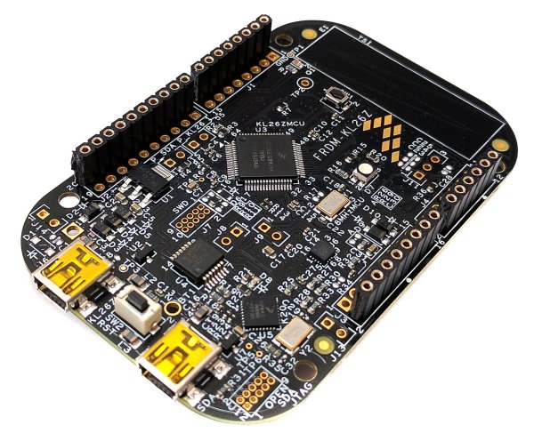
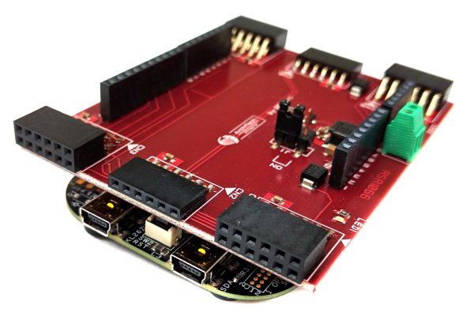

Connect the PMOD module to the CN7 then power supply the FRDM board via mini USB connection.

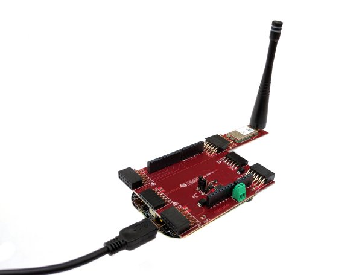

Configure the FRDM-KL26Z with OpenSDA interface
***********************************************

1. In order to install the lastest firmware go to the webpage `OpenSDA Support <http://www.pemicro.com/opensda/>`_. 

2. Download and install **Windows USB Drivers Download PEDrivers_install.exe** from `pemicro website <http://www.pemicro.com/downloads/download_file.cfm?download_id=301>`_. It is required to register in the website.

3. Then download the lastest `Firmware Apps (.zip file) <http://www.pemicro.com/downloads/download_file.cfm?download_id=378>`_.

4. Finally connect the FRDM-KL26Z board to the PC via mini-USB connector **OpenSDA**, placing the board in Bootloader mode (hold the Reset button down while connecting to USB, then release it). Your board will then be visible as a drive labelled **BOOTLOADER**. From the **Firmware Apps** zip copy into the BOOTLOADER disk the file **DEBUG_OpenSDA_for_MBED_Bootloader_by_Pemicro_v1XX.bin** (where XX is the lastest version). Now unplag the USB cable.

Import Project
**************

1. Launch Codewarrior and select a folder for the workspace. Our project will be imported in this directory. In this guide we used this path:

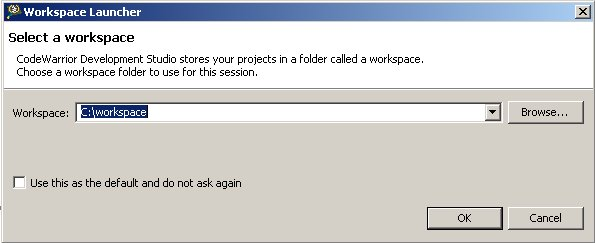

2. Go to **File -> New** and select **Project...**.

3. Select **General -> Project** and click on **Next >** button.

.. image:: _static/codewarrior_new_project.jpg

4. Create the project assigning the name **PMODSigfox** and clicking on **Finish** button.

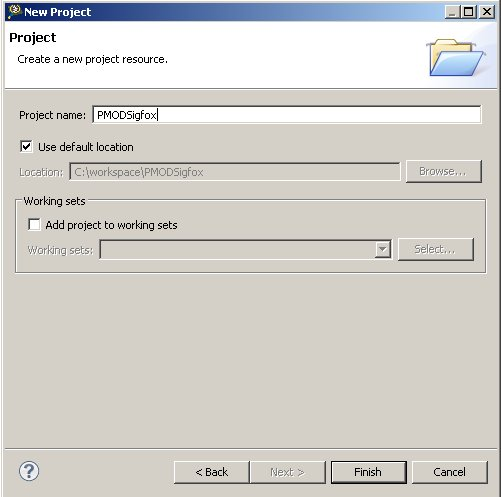

5. Press the right button mouse on PMODSigfox project icon and select **Import...**

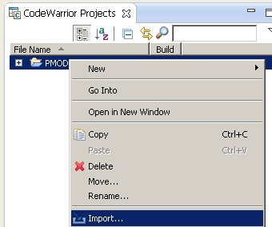

6. Select **General -> Archive File** and click on **Next >** button.

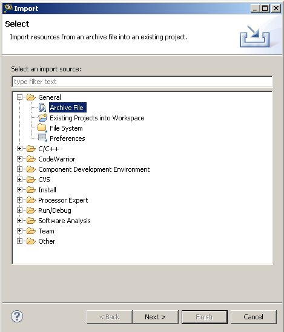

7. Select the archive file browsing to the zip file **lib_sigfox** and select into the folder **PMODSigfox**. Then click on **Finish**.

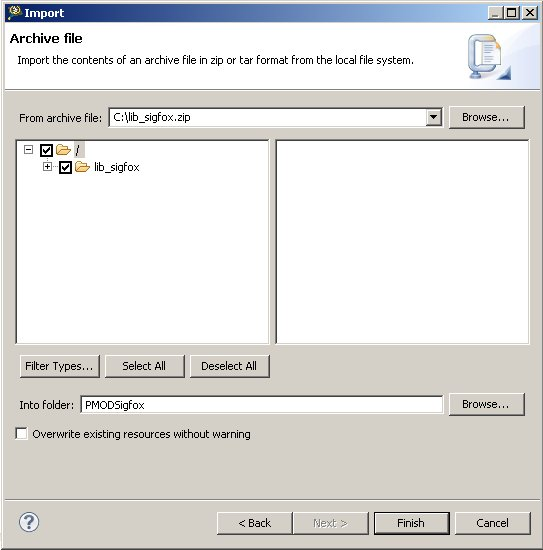

Build & Debug
*************

8. Now you have to open **Process Expert Window** double clicking on **ProcessorExpert.pe**

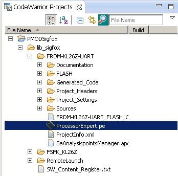

9. Now it's time to compile the sources code, go to **Project -> Build All**

10. Once compiling is finished connect the mini usb from the PC to the FRDM board. Then go to **Run -> Debug configurations...**

11. Finally select FRDM-KL26Z-UART_FLASH_OpenSDA and choose the type of connection than click on the **Debug** button.

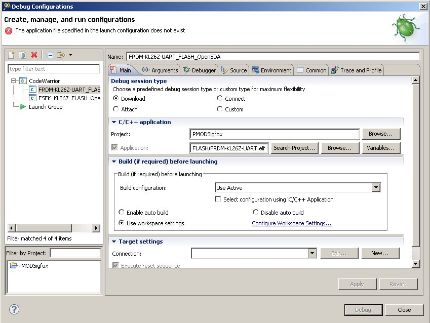

Processor Expert
****************
Processor Expert Software is a development system to create, configure, optimize, migrate, and deliver software components that generate source code for the microcontroller. For more information please go `here <http://www.nxp.com/products/software-and-tools/software-development-tools/processor-expert-and-embedded-components:BEAN_STORE_MAIN>`_,

