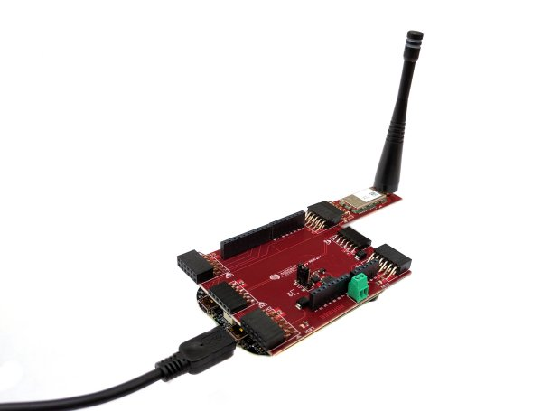

.. index:: hardware

.. _hardware:

Hardware Guide
--------------

The board is provided with:

- NXP KL26Z board
- TD1207 Module Sigfox
- RSR1066 board

The TD1207 module provides a protocol connectivity using a simple UART interface. The NXP **MKLS26Z** is connected to the TD1207 module using the configuration 9600 8N1 without using RTS, CTS lines.

The board
*********

Commands used
*************

The comand to send data in the Lora network is:

- **AT$SS=18 AA BB CC**: used to send the frame *18AABBCC*

Datasheet and more
******************

Please refer to `architechboards <http://architechboards.org/>`_ website.

.. image:: _static/logo_architech.jpg

